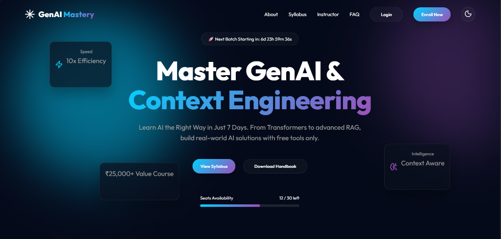
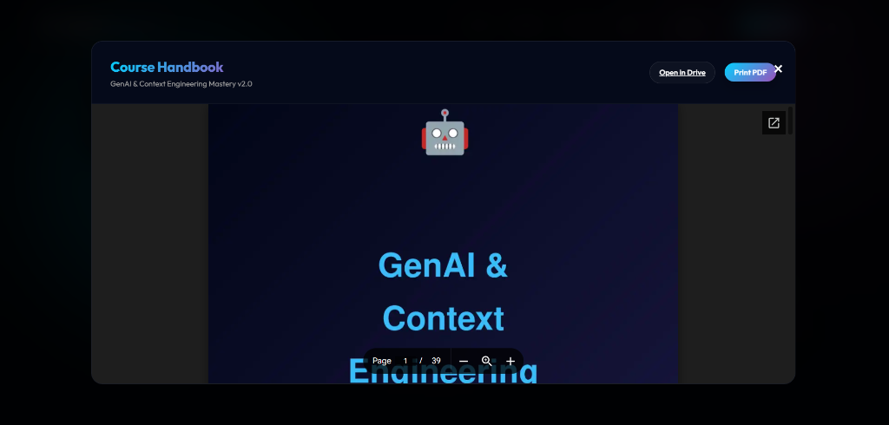
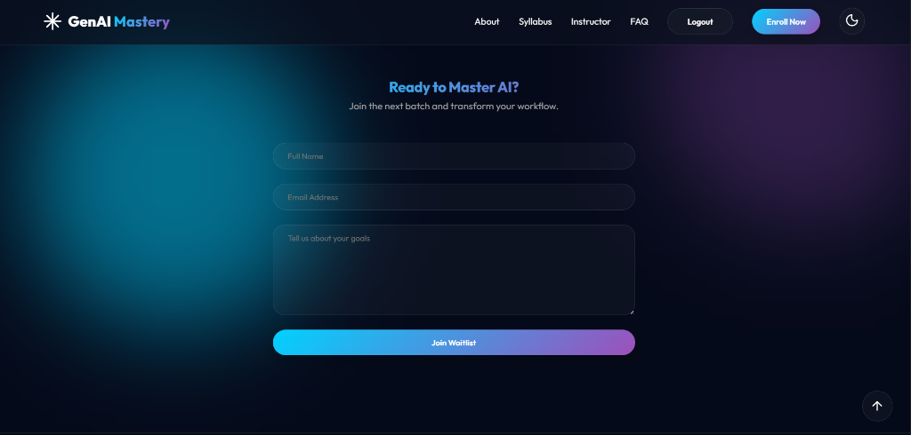
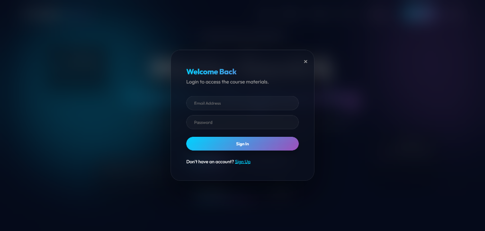

# 🚀 GenAI & Context Engineering Mastery Bootcamp

## A Premium, Ultra-Modern Landing Page & Interactive Syllabus Hub (Full-Stack Edition)

[](https://developer.mozilla.org/en-US/docs/Web/HTML)
[](https://developer.mozilla.org/en-US/docs/Web/CSS)
[](https://developer.mozilla.org/en-US/docs/Web/JavaScript)
[](https://supabase.com)
[](https://vitejs.dev)
[](https://webpattydb.netlify.app/)

Welcome to the official repository for the **GenAI & Context Engineering Mastery Bootcamp** landing page — **Full-Stack Edition**. This web application serves as a high-converting, premium marketing landing page and interactive curriculum dashboard with **user authentication** and **database persistence**. It presents a comprehensive, fast-paced 7-day bootcamp roadmap covering everything from Transformer foundations to advanced Retrieval-Augmented Generation (RAG) and Context Architecture.

> [!NOTE]
> 💡 **A Note from the Author:**
> This project is a milestone for me — **it is my first web application ever!** It is built using Generative AI (I built this to learn frontend development, backend integration, and AI-assisted workflows). It represents my transition into web development, focusing on building high-fidelity interfaces, modular interactions, responsive design systems, and real backend services.

---

## 🛠️ Technology Stack

This application is built with a vanilla front-end stack backed by modern cloud services:

*   **HTML5** ([index.html](genai-context-main/genai-bootcamp/index.html)): Structured semantic layout featuring bento-grid layouts, custom modals, and SVG graphics.
*   **Vanilla CSS3** ([style.css](genai-context-main/genai-bootcamp/style.css)): Fully custom UI styling utilizing HSL-tailored colors, high-end glassmorphism, responsive flex/grid layouts, smooth animations (moving mesh background blobs), and unified design tokens.
*   **Vanilla JavaScript** ([script.js](genai-context-main/genai-bootcamp/script.js)): Client-side orchestration for the fuzzy-search syllabus engine, expandable accordions, interactive countdown timer, randomized seat availability progress bar, dark/light mode toggle, and modal controls.
*   **Supabase** (Backend-as-a-Service): Provides **user authentication** (signup/login/logout with session management) and **database persistence** for waitlist enrollments.
*   **Vite**: Modern build tool for development, bundling, and preview.
*   **Lucide Icons**: Modern SVG icon library loaded via CDN to elevate visual aesthetics.

---

## 🌟 Key Features

1.  **Premium Aesthetics & Theme Support**:
    *   **Animated Blob Mesh**: Soft CSS gradients shift slowly in the background to capture user attention.
    *   **Glassmorphism Cards**: Semi-transparent overlays create depth and a modern software-as-a-service feel.
    *   **Seamless Light/Dark Mode**: Dynamic style toggle allows users to switch modes instantly without content shift.
2.  **Interactive 7-Day Curriculum**:
    *   **Real-time Search Filter**: Users can filter syllabus topics on-the-fly (e.g., searching "RAG" automatically displays Days 4 & 6 and hides others).
    *   **Accordion Details**: Clean expand/collapse animations for each day showing course goals, topics, and mini-projects.
3.  **Handbook PDF Integration**:
    *   **Pre-download Dialog**: A premium popup modal explaining handbook contents.
    *   **Embedded Viewer**: Google Drive PDF iframe integration with "Print PDF" and cross-origin fallback redirects.
4.  **Enrollment Simulation**:
    *   **Live Countdown**: Visual countdown badge showing the next batch start date.
    *   **Scarcity Indicator**: Auto-updating progress bar simulating seats filling up.
    *   **Waitlist Form**: Client-validated form with submission feedback states ("Applying..." to "Successfully Joined!").
5.  **User Authentication (Full-Stack Feature)**:
    *   **Email/Password Signup & Login**: Secure authentication powered by Supabase Auth.
    *   **Session Persistence**: Users stay logged in across page refreshes.
    *   **Protected Content**: Handbook PDF access requires authentication — unauthenticated users are prompted to login.
6.  **Database Persistence (Full-Stack Feature)**:
    *   Waitlist registrations submitted via the contact form are stored in a **Supabase database**.
    *   User profiles and enrollment data persist across sessions.

---

## 📸 Screen Gallery

Check out the responsive layout of the web application in action:

| 🌌 Hero Section (Dark Mode) | 💡 Syllabus & Curriculum (Light Mode) |
| :---: | :---: |
|  |  |

| 📄 Embedded Handbook Modal | ✍️ Waitlist Registration Form |
| :---: | :---: |
|  |  |

| 🔐 Login / Signup Modal |
| :---: |
|  |

---

## 🚀 Live Deployment

The application is deployed and publicly accessible online:
🔗 **[Visit GenAI & Context Engineering Mastery Bootcamp](https://webpattydb.netlify.app/)**

---

## ⚙️ How to Run Locally

If you want to spin up a local instance of the landing page, follow these instructions:

1.  **Clone the Repository**:
    ```bash
    git clone https://github.com/AniketDaiya/webwithdb.git
    ```
2.  **Navigate to the Project Root**:
    ```bash
    cd webwithdb
    ```
3.  **Install Dependencies**:
    ```bash
    npm install
    ```
4.  **Set Up Environment Variables**:
    Create a `.env` file in the root directory with your Supabase credentials:
    ```env
    VITE_SUPABASE_URL=your_supabase_url
    VITE_SUPABASE_ANON_KEY=your_supabase_anon_key
    ```
5.  **Run the Development Server**:
    ```bash
    npm run dev
    ```
    Then, open `http://localhost:5173` in your web browser.

---

## 🐛 Bugs & Troubleshooting (For Developers)

*   **PDF Cross-Origin Printing**: Standard security policy might block the direct printing of Google Drive PDFs within an iframe (`printIframe()` function). If blocked, the script automatically triggers a graceful fallback, opening the document in a new window tab.
*   **Fuzzy Search Performance**: The search filter targets the custom element attributes `data-topics` and `h3` tags. If you expand the curriculum, remember to add your search terms to the `data-topics` attribute of the corresponding `.day-card` in [index.html](genai-context-main/genai-bootcamp/index.html).
*   **Theme Storage**: The toggle sets the `data-theme` attribute on the `<body>` element. If customizing color themes, look at the variable definitions in the header of [style.css](genai-context-main/genai-bootcamp/style.css).
*   **Supabase Environment Variables**: Make sure your `.env` file contains valid `VITE_SUPABASE_URL` and `VITE_SUPABASE_ANON_KEY` values. The app will gracefully handle missing credentials but authentication features will be unavailable.

---

## 🔮 Future Scope

This project has a solid foundation and there is plenty of room to grow. Here are some exciting features planned for future releases:

*   **✨ Enhanced Content & Syllabus**: Expand the curriculum with more advanced topics, additional days, deeper dives into fine-tuning, agentic AI workflows, and real-world case studies.
*   **🤖 AI Widget / Chat Agent**: Integrate an interactive AI assistant directly on the page to answer visitor questions about the bootcamp, syllabus, pricing, and enrollment — a 24/7 smart Q&A agent.
*   **📊 Admin Dashboard**: Build a secure admin panel to view enrollment data, manage users, and monitor waitlist signups in real time.
*   **📈 Progress Tracking**: Allow enrolled users to track their learning progress, mark completed modules, and receive personalized recommendations.
*   **💳 Payment Integration**: Add secure payment processing for course enrollment with Stripe or Razorpay.
*   **📱 Mobile App**: Develop a companion mobile app for on-the-go learning and notifications.

> [!IMPORTANT]
> **Looking for the Frontend-Only Version?**
> If you are looking for a simpler version of this application without authentication and database features, check my **other GitHub repository**: [context-cooking-101](https://github.com/AniketDaiya/context-cooking-101) — a pure frontend, static version of this landing page.

---

## 🤝 Let's Connect & Be Friends!

Since this is my very first web application, I would love to connect, get your feedback, and collaborate! Feel free to reach out and follow my social profiles:

*   **GitHub**: [@AniketDaiya](https://github.com/AniketDaiya) 🚀
*   **LinkedIn**: [in/aniket-daiya-1473b93a3](https://www.linkedin.com/in/aniket-daiya-1473b93a3/) 💼

*Thank you for visiting my project! If you like what you see, feel free to give the repository a ⭐️!*
